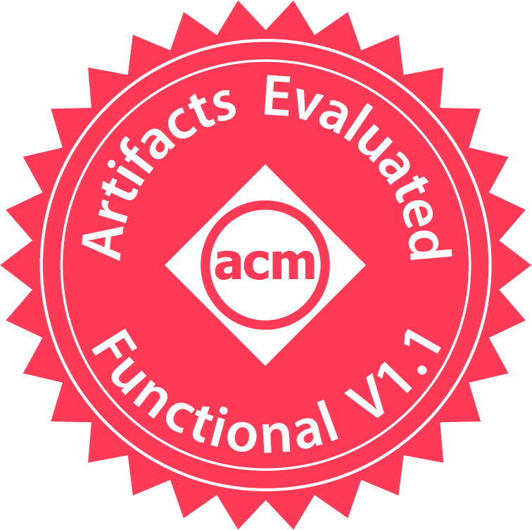
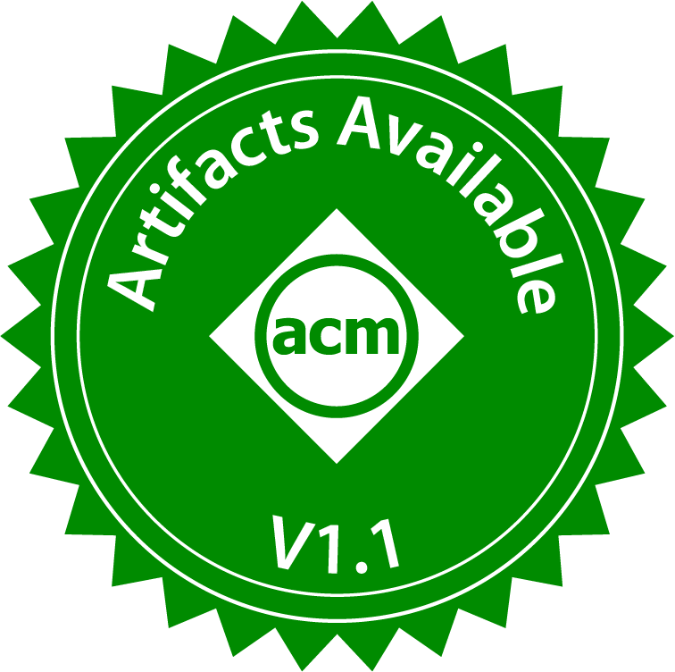
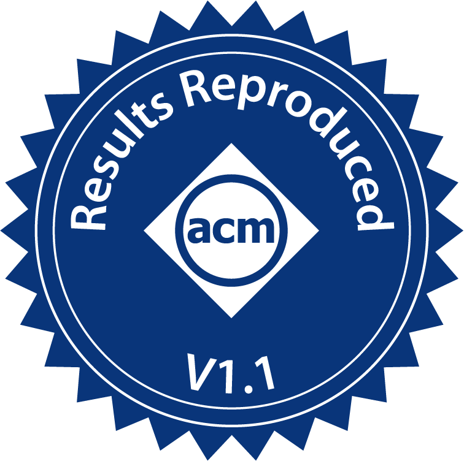

<section id="Links">
<h3>Links</h3>

<a href="https://scholar.google.com/citations?user=gM6CWGoAAAAJ&hl=en">[Google Scholar]</a> 
<a href="https://github.com/kvgarimella">[GitHub]</a> 
<a href="media/resume.pdf">[Resume]</a> 
                kvgarimella AT nyu DOT edu

</section>


<section id="blog">
<h3>Writing</h3>
<ul>
    
<li>{{ post.date | date: "%Y-%m-%d" }} — <a href="{{ post.url | relative_url }}">{{ post.title }}</a></li>
    
</ul>

<a href="{{ '/blog/' | relative_url }}">All writing →</a>

</section>


<section id="bio">
<h3>Bio</h3>

I am a final year ECE PhD candidate at New York University advised by <a href="https://engineering.nyu.edu/faculty/brandon-reagen">Brandon Reagen</a>. I also collaborate with <a href="https://engineering.nyu.edu/faculty/siddharth-garg">Siddharth Garg</a>. My work sits at the intersection of machine learning systems, compilers, and computer architecture, with a focus on privacy-preserving inference using Fully Homomorphic Encryption (FHE). I built <a href="https://github.com/baahl-nyu/einhops">EinHops</a>, which brings an einsum-style programming abstraction to FHE and helped develop <a href="https://github.com/baahl-nyu/orion">Orion</a>, an encrypted neural inference framework. During summer 2024, I interned at NVIDIA Research in the Programming Systems and Applications group.

Before NYU, I earned an MS in Computer Engineering from Washington University in St. Louis where I worked on self-driving vehicles and adversarial machine learning. I also hold a BA in Physics from Hendrix College.

 I am currently on the job market looking for research engineer and scientist roles. Please feel free to reach out! 

</section>

<section id="publications">
<h3>Publications</h3>

<article>

<strong>HE-LRM: Efficient Private Embedding Lookups for Neural Inference Using Fully Homomorphic Encryption</strong> 
<u>Karthik Garimella</u>, Austin Ebel, Gabrielle De Micheli, Brandon Reagen 
In Submission, 2026 
<a href="https://arxiv.org/abs/2506.18150">[arXiv]</a>

</article>

<article>

<strong>EinHops: Einsum Notation for Expressive Homomorphic Operations on RNS-CKKS Tensors</strong> 
<u>Karthik Garimella</u>, Austin Ebel, Brandon Reagen 
                   Workshop on Applied Homomorphic Encryption @ ACM CCS, 2025 
<a href="https://arxiv.org/abs/2507.07972">[arXiv]</a> 
<a href="https://github.com/baahl-nyu/einhops">[code]</a> 

</article>

<article>

<strong>Orion: A Fully Homomorphic Encryption Framework for Deep Learning</strong> 
                   Austin Ebel, <u>Karthik Garimella</u>, Brandon Reagen 
                   ASPLOS, 2025, <b><i>Best Paper Award</i></b>  
<a href="https://arxiv.org/abs/2311.03470">[arXiv]</a> 
<a href="https://github.com/baahl-nyu/orion">[code]</a> 

</article>

<article>

<strong>Characterizing and Optimizing End-to-End Systems for Private Inference</strong> 
<u>Karthik Garimella</u>, Zahra Ghodsi, Nandan Kumar Jha, Siddharth Garg, Brandon Reagen 
                   ASPLOS, 2023 

 
<a href="https://arxiv.org/abs/2207.07177">[arXiv]</a> 
<a href="https://github.com/kvgarimella/cryptonite">[code]</a> 
<a href="media/asplos-poster.pdf">[poster]</a>

</article>

<article>

<strong>CryptoNite: Revealing the Pitfalls of End-to-End Private Inference at Scale </strong> 
<u>Karthik Garimella</u>, Nandan Kumar Jha, Zahra Ghodsi, Siddharth Garg, Brandon Reagen 
                   arxiv pre-print, 2021 
<a href="https://arxiv.org/abs/2111.02583">[arXiv]</a> 

</article>

<article>

<strong>Sisyphus: A Cautionary Tale of Using Low-Degree Polynomial Activations in Privacy-Preserving Deep Learning </strong> 
<u>Karthik Garimella</u>, Nandan Kumar Jha, Brandon Reagen 
                   Privacy Preserving Machine Learning Workshop @ ACM CCS, 2021 
<a href="https://arxiv.org/abs/2107.12342">[arXiv]</a> 
<a href="https://github.com/kvgarimella/sisyphus-ppml">[code]</a> 
<a href="media/sisyphus-poster.pdf">[poster]</a>

</article>

<article>

<strong>Attacking Vision-based Perception in End-to-End Autonomous Driving Models</strong> 
                   Adith Boloor, <u>Karthik Garimella</u>, Xin He, Christopher Gill, Yevgeniy Vorobeychik, Xuan Zhang 
                   Journal of Systems Architecture, 2020 
<a href="https://arxiv.org/abs/1910.01907">[arXiv]</a> 
<a href="https://github.com/xz-group/AdverseDrive">[code]</a> 

</article>

<article>

<strong>CARLA Autonomous Driving Challenge 2019</strong> 
                   Adith Boloor, <u>Karthik Garimella</u>, Jinghan Yang, Christopher Gill, Yevgeniy Vorobeychik, Ayan Chakrabarti, Xuan Zhang 
                   Invited talk at CVPR, 2019 
<a href="https://carlachallenge.org/workshop/">[CVPR workshop]</a> 
<a href="https://github.com/jinghanY/AutonomousDrivingAgent">[code]</a> 

</article>

</section>
<section id="teaching">
<h3>Teaching</h3>

Head Graduate Teaching Assistant - Deep Learning Spring 2023 @ NYU ECE 
Head Graduate Teaching Assistant - Computer Architecture Fall 2023 @ NYU ECE

</section>
